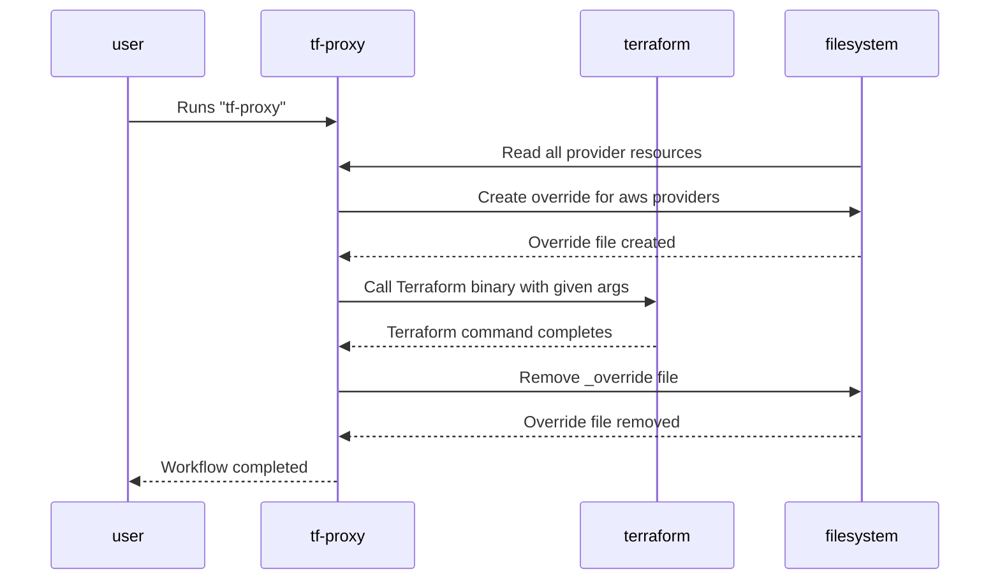

# tf-proxy

One of the main reasons for the tool is limitation of `HTTP_PROXY` as described in the :octocat: issue [#17386](https://github.com/hashicorp/terraform/issues/17386)

:bulb: A specialized wrapper for the Terraform binary that enables selective provider proxying. This tool allows you to intercept and modify Terraform provider configurations on-the-fly, making it particularly useful for testing, development, and specific deployment scenarios. Or in case you're in corporation that puts proxy in front of everything :smile: 

---

⚠️ This tool is experimental and build for very specific use case. Any suggestions to make this more useful are very welcomed.


## Overview

tf-proxy acts as an intermediary between your Terraform commands and the actual Terraform binary. It intercepts provider configurations, creates temporary overrides for specific providers (like AWS), and ensures clean removal of these overrides after Terraform operations complete.

## How it works?



## Configuration

The tool can be configured using a YAML configuration file. This file should be placed in `~/.tf-proxy.yaml` directory.

### Configuration File Structure

```yaml
# Default proxy to use when no specific proxy is defined for a provider
default_proxy: "http://proxy.example.com:8080"

# Provider-specific configurations
providers:
  # AWS provider configuration
  aws:
    type: "provider"  # Specifies this is a provider configuration
    proxy: "http://aws-proxy.example.com:8080"  # Optional: specific proxy for AWS

  # S3 backend configuration
  s3:
    type: "backend"  # Specifies this is a backend configuration for state management
    proxy: "http://s3-proxy.example.com:8080"  # Optional: specific proxy for S3 state backend

  # Google provider configuration (empty configuration defaults to default_proxy and "provider" type)
  google:
```

### Configuration Options

#### Global Settings
- `default_proxy`: Default proxy URL to use when no specific proxy is defined for a provider

#### Provider Settings
For each provider/backend:
- `type`: Specifies whether this is a "provider" or "backend" configuration
  - Valid values: "provider" or "backend"
- `proxy`: (Optional) Specific proxy URL for this provider/backend
  - If not specified, the default_proxy will be used

## Usage

Use tf-proxy just like you would use the Terraform binary:

```bash
# Basic usage
tf-proxy init
tf-proxy plan
tf-proxy apply

# With additional arguments
tf-proxy plan -var="environment=prod"
```
