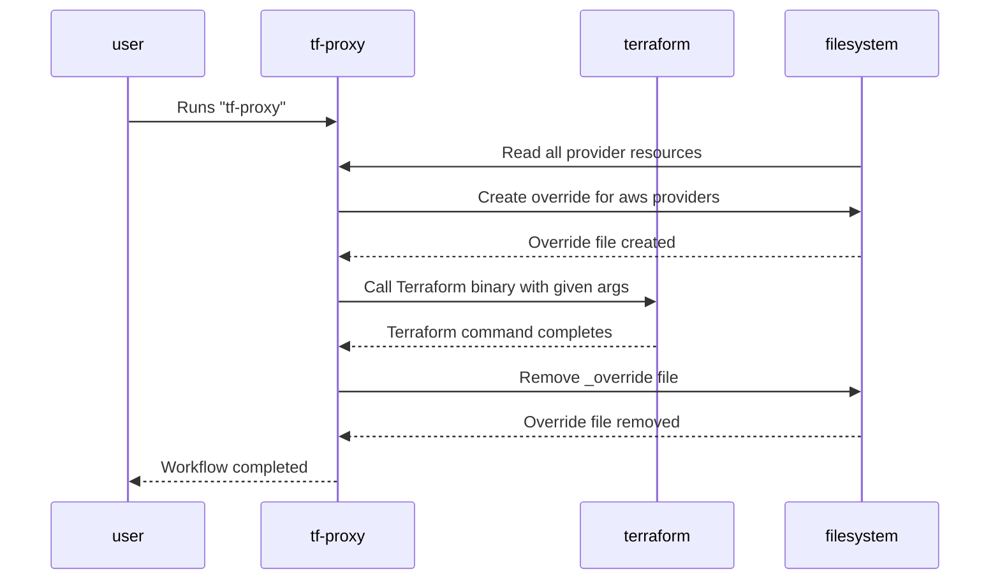

# (WIP) tf-proxy

Experimental project that wraps terraform binary with purpose to proxy only specific providers.

## Usage

Set `TERRAFORM_HTTPS_PROXY` environment value and simply run `tf-proxy` binary instead of terrafom i.e. `tf-proxy init`.

:warning: Configuration is not yet exposed and at the moment it's embeded only internaly set for AWS providers.

```
		TargetProviders:  []string{"backend/s3", "provider/aws"},
```

## How it works?



