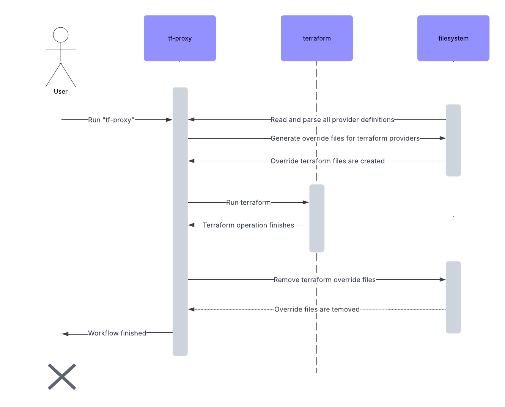

# tf-proxy

Experimental project that wraps terraform binary with purpose to proxy only specific providers.

## Usage

Set `TF_PROXY_HOST` environment variale and simply run `tf-proxy` binary instead of terrafom i.e. `tf-proxy init`.

At this stage, it's possible to have only one proxy and provider whitelist is done via `TF_PROXY_PROVIDERS`.

Format of the whitelist is comma separated list of providers and backends `provider/aws,backend/s3`. Whitelist format supports
also aliases `provider/aws/example-alias`.

Configuration will get more flexible and advanced once I shape use cases a bit more.

## How it works?

